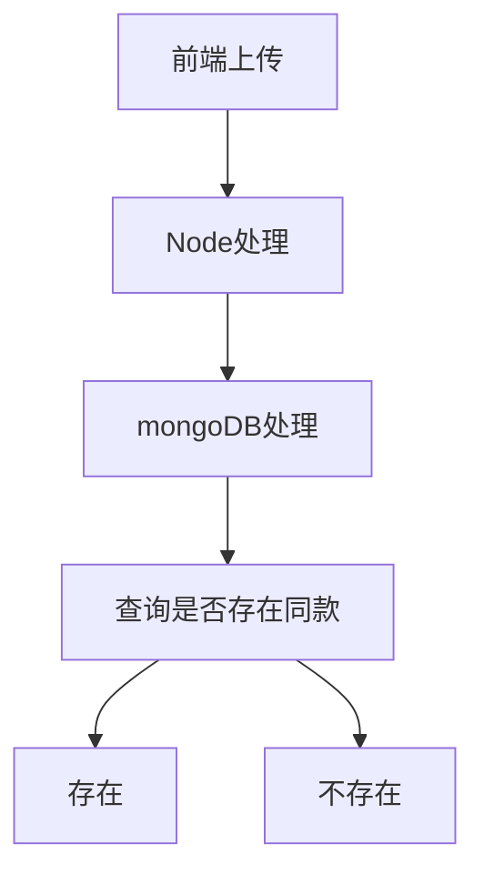

# 计划

- [ ] 深入浅出Vue.js
- [ ] 学习TS
- [ ] 学习React
- [ ] 学习Egg


滚动页面 实现动画来回加载


信用卡刷出1.5w

老婆还我1.5w

有钱花 5k 

还差1.5w


收到货的商品和描述的商品不符合，不是同一款商品，卖家描述图中商品是9成新，到货后为7成新，有明显掉漆，部分位置生锈，存在无法擦出污垢（如图）。由于大件物品，不包运费，来的运费是我自己出的，收货后还发现到货的商品和描述的商品完全不一致，不是同一款，最明显的证据就是防护栏的标签，不仅位置不一样，而且标签内容也是不一样（如图），而且描述图中商品是没有粘贴任何东西，到货的商品有绿色的防撞条。


整理了几个实习期间遇到的比较有技术含量的难点，比如遇到了什么问题、现象是什么、分析的思路、用了什么工具做了什么、最终解决问题的方案是什么。





localhost


1、得物开发平台  要求商家

2、抓数据  签名算法无

3、安卓机+auto.js


收集目前手上有二维码的店铺，收集特价店铺的信息 奥特莱斯


存入整单

前端划分数据


如何从react 如何从js转ts

1、安装依赖

```
npm install --save typescript @types/node @types/react @types/react-dom @types/jest
```

2、删除node_modules

3、`npm i`

默认支持jsx tsx 共存 `tsconfig.json文件中的"allowJs": true`


使用Pro-table的时候遇到了“Cannot read property 'Provider' of undefined

这个问题是因为antd的版本太低 Pro-table版本太高，无法支持 升级下antd即可

https://github.com/ant-design/pro-components/issues/1844

